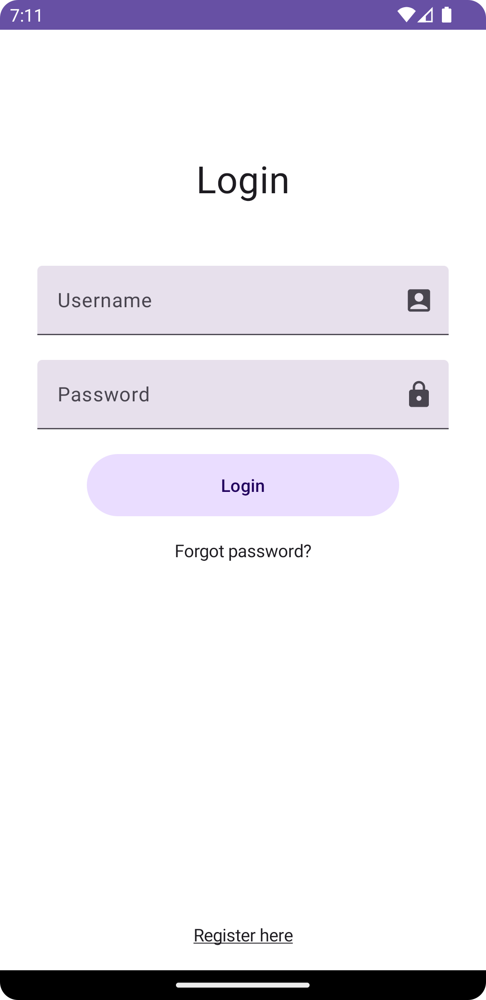
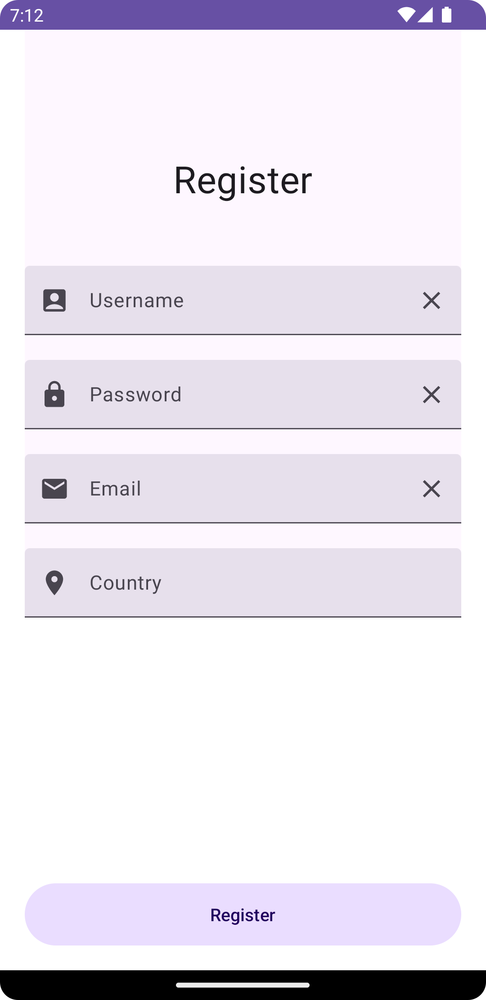
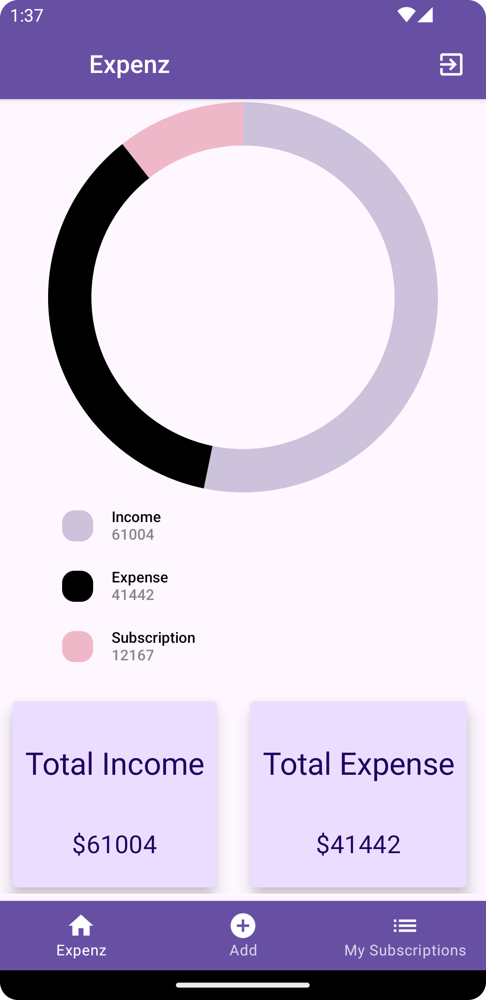
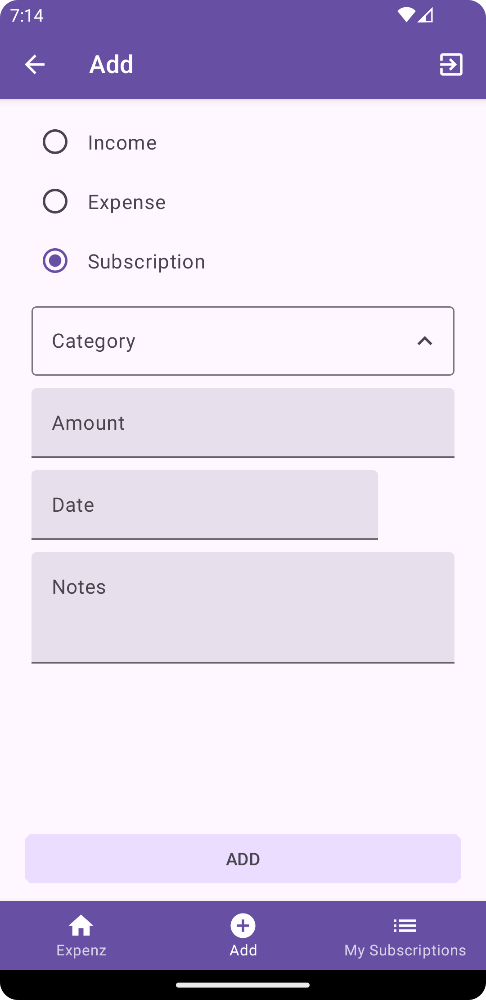
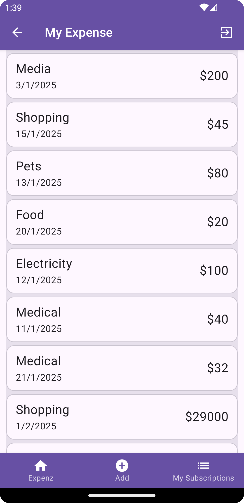
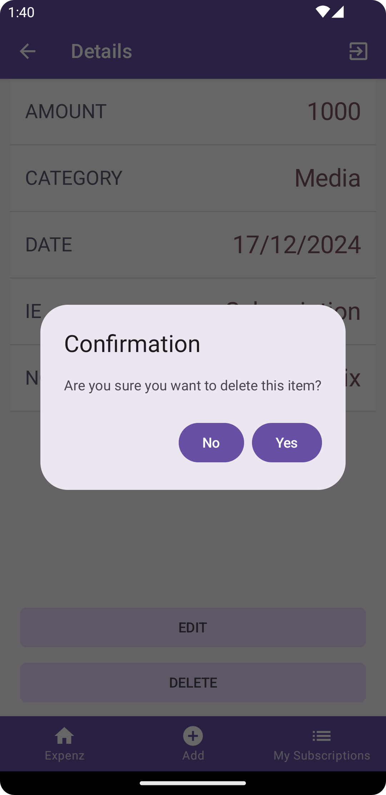

 
  

  ## About
Expenz App lets you to manage your day to day Expenses. This app Keeps track of all your expenses locally. Create your account and start adding up your incomes and expenses on day to day basis. 

## Features
 This Android App lets You to :
 - Add new income/expense in your day to day life.
 - Update the expenses if needed to.
 - Delete expenses.
 - View data in piechart animation
   

## App Flow
   
 
 
 
 
 
